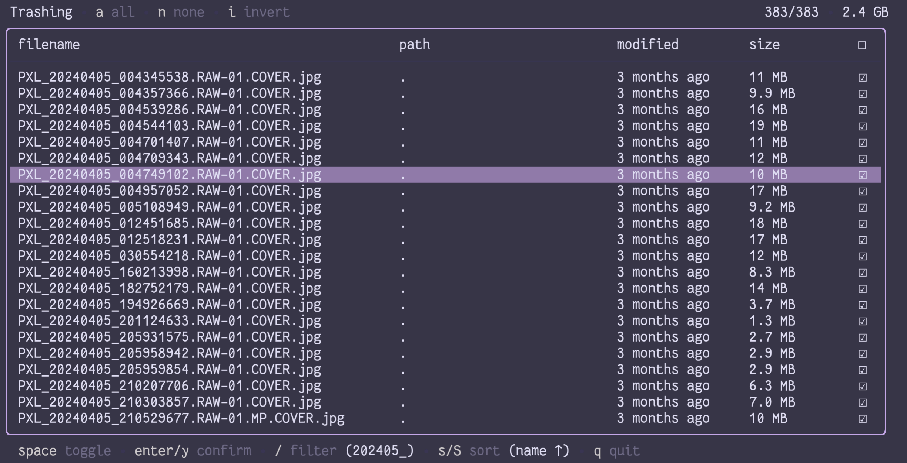
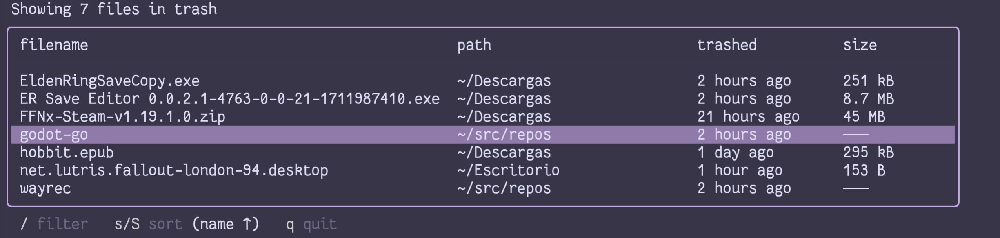

# gt

g(o)t(rash) is a simple, command line program to interface with the XDG Trash. Files in the trash may be listed, cleaned, or restored via an interactive table, and filtered with various  flags.

## Interactive Mode

Run with no args to start interactive mode. In interactive mode, files in the trash are displayed, and may be selected to either restore or remove permanently.

## rm-like Trashing

Run with no command and only filename(s) as argument(s) to skip displaying files, sending them straight to the trash, in a quick, rm-like way.

## Commands

Files are displayed in an interactive table, allowing them to be sorted, filtered, and selectively operated on.

### trash / tr

Find files on the filesystem based on the filter flags and any filename args.

#### flags

*--recursive*, *-r*
operate on files recursively

*--work-dir* **dir**, *-w* **dir**
operate on files in this directory

*--hidden*, *-h*
operate on hidden files

### list / ls

Find files in the trash based on the filter flags and any filename args.

#### flags

*--non-interactive*, *-n*
list files and quit

*--original-path* **dir**, *-O* **dir**
list files trashed from this directory

### restore / re

Find files in the trash based on the filter flags and any filename args.

#### flags

*--all*, *-a*
restore all files in trash

*--original-path* **dir**, *-O* **dir**
*restore* files trashed from this directory

### clean / cl

Find files in the trash based on the filter flags and any filename args.

#### flags

*--all*, *-a*
clean all files in trash

*--original-path* **dir**, *-O* **dir**
remove files trashed from this directory

## Flags

### Global flags

*--confirm*, *-c*
ask for confirmation before executing any action

*--log* **level**, *-l* **level**
set log level

### Filter flags (usable with all commands)

*--match* **pattern**, *-m* **pattern**
operate on files matching regex pattern

*--glob* **pattern**, *-m* **pattern**
operate on files matching glob

*--not-match* **pattern**, *-M* **pattern**
operate on files not matching regex pattern

*--not-glob* **pattern**, *-G* **pattern**
operate on files not matching glob

*--on* **date**, *-O* **date**
operate on files modified on date

*--before* **date**, *-B* **date**
operate on files modified before date

*--after* **date**, *-A* **date**
operate on files modified after date

*--files-only*, *-F*
operate on files only

*--dirs-only*, *-D*
operate on directories only

*--min-size* **size**, *-N* **size**
operate on files larger than size

*--max-size* **size**, *-X* **size**
operate on files smaller than size

*--mode* **mode**, *-x* **mode**
operate on files matching mode mode

See also gt(1) or `gt --help`.

## Screenshots

